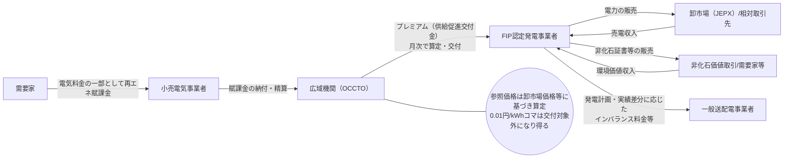
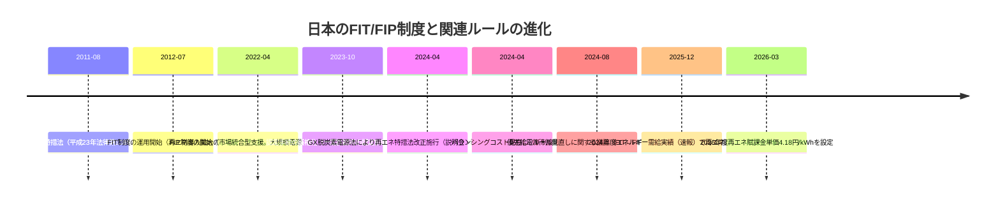
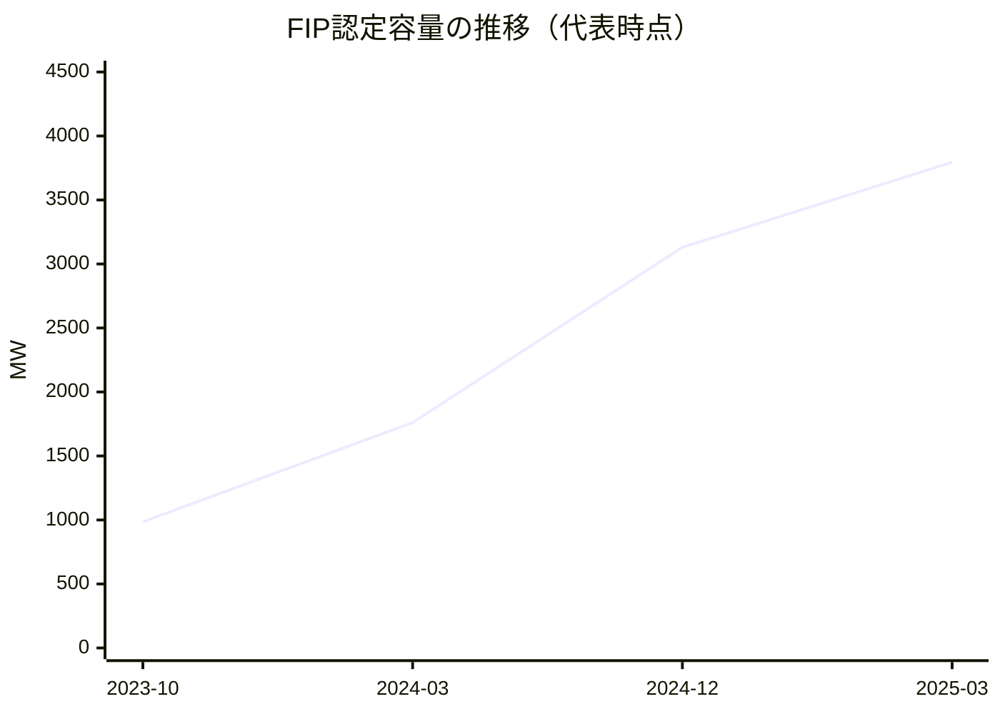
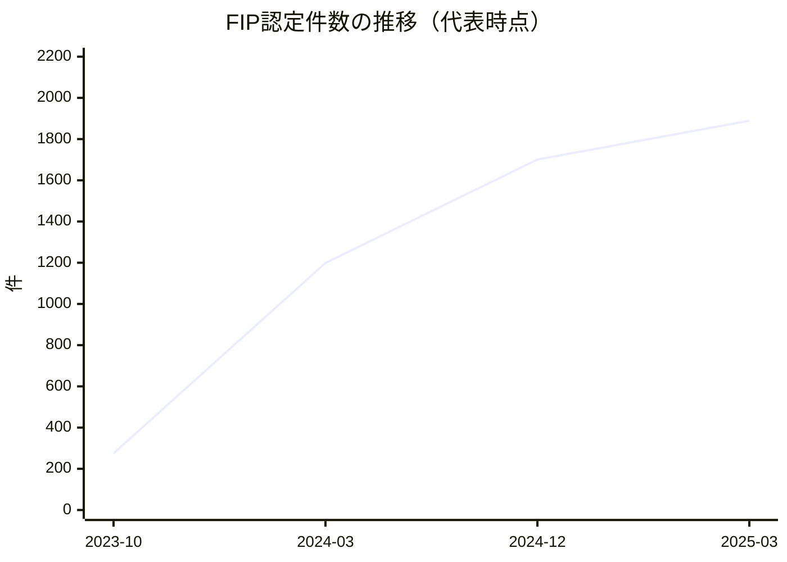
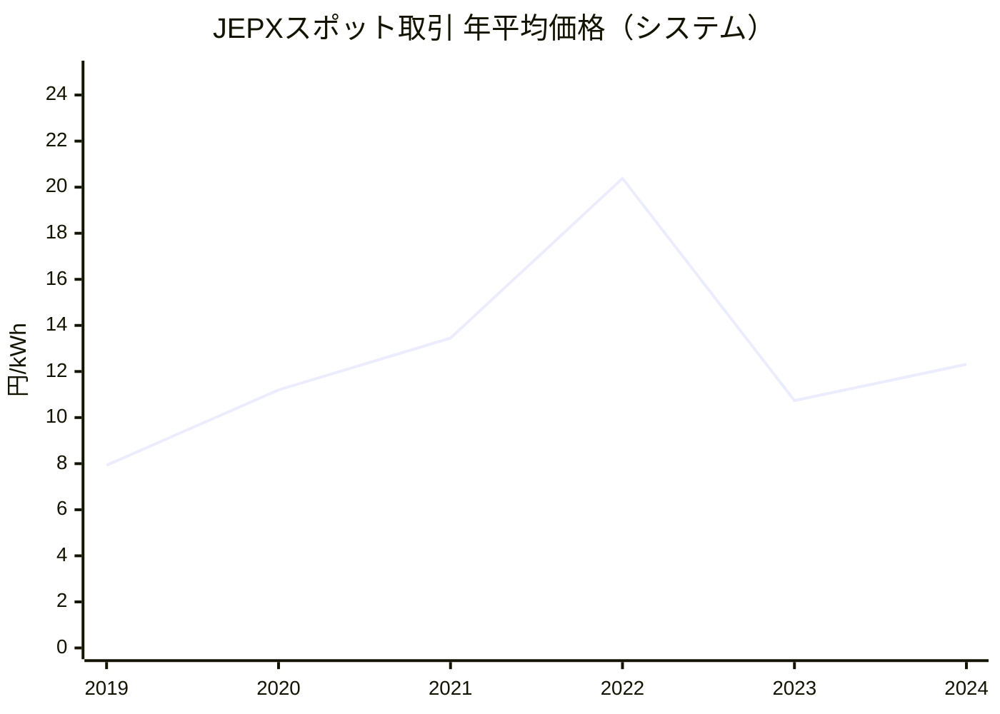
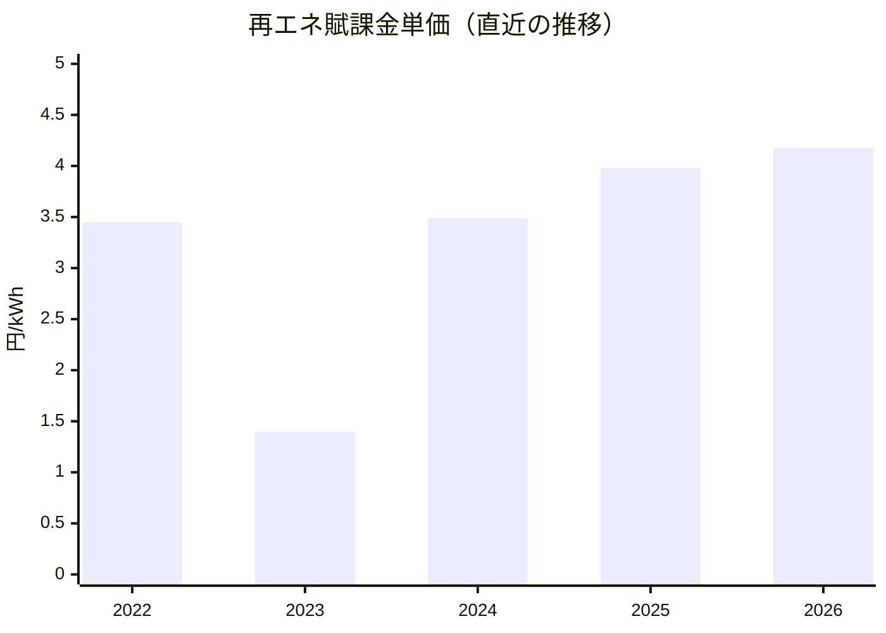
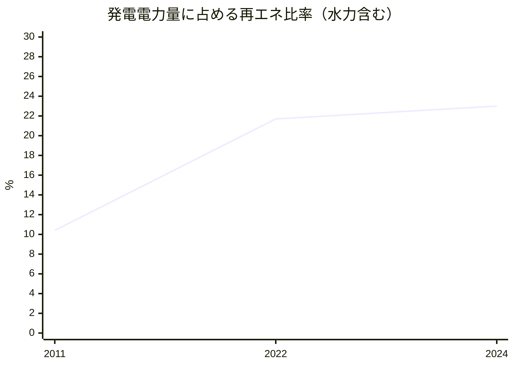

# 日本のFIP制度を完全理解するための分析レポート

## エグゼクティブサマリー

**As-of date：2026-04-13（Asia/Tokyo）**

日本のFIP制度（Feed-in Premium）は、再エネ発電事業者が卸電力市場や相対で電気を売り、その市場収入に対して「不足分」をプレミアム（法令上は供給促進交付金）で補うことで、投資インセンティブを確保しつつ**市場統合**（価格シグナルに沿った供給行動、需給調整、出力制御の抑制等）を促す制度である。制度設計上の核は「**基準価格**（固定）－ **参照価格**（市場連動）＝ **プレミアム単価**」で、プレミアムは**毎月**決定される。citeturn17search2turn17search13

日本のFIPは、欧州で一般的な「two-way（上振れ時は回収する双方向）」ではなく、実務上は**one-way（プレミアムがマイナスにならない）**として設計されている。参照価格（市場参照価格）が基準価格を上回る場合、参照価格側を基準価格に補正することで、プレミアムは原則ゼロ（ただしバランシングコスト相当は残る）となり、**マイナスの徴収は行われない**。citeturn18view0turn17search15turn17search16

参照価格は単に当月の市場価格そのものではなく、「前年度年間平均市場価格＋（当年度月間平均市場価格－前年度月間平均市場価格）」という**前年差分補正**を含む。加えて、非化石価値相当額（環境価値の期待収入）やバランシングコスト（インバランスリスク単価等）を勘案する。自然変動電源（太陽光・風力）は発電特性を踏まえ、30分コマ価格を加重平均するという考え方が示されている。citeturn17search0turn18view0turn14view0turn35view1

制度運用（精算・交付）は、entity["organization","電力広域的運営推進機関","electricity system operator, tokyo, japan"]（以下、広域機関）が担い、交付金は原則として認定事業者へ直接交付される。交付スケジュールは「N月供給分 → N+2か月に算定・通知 → N+3か月上旬に交付」が目安である。citeturn18view0

市場統合の実務上の重要点は2つある。第1に、FIP電源は「発電計画の策定と予測誤差への対応」が求められ、インバランスリスクを一定程度負担する（その補助としてバランシングコスト相当額がプレミアムに上乗せされる時期・ルールがある）。citeturn20view0turn34view0 第2に、出力制御（需給バランス制約等）との整合として、エリアプライスが**0.01円/kWh**となる30分コマはプレミアム交付対象外とされ、制度趣旨（出力制御が発生する時間帯に補助しない）に沿う設計が組み込まれている。citeturn18view0turn17search0turn23view0

定量的には、FIP活用は制度開始後しばらく緩やかだったが、2023年度下半期に認定件数が大きく増加したことが審議会資料で示され、バランシングコスト見直し（2024年4月新制度開始）の議論が事業者行動を後押しした可能性が指摘されている。citeturn35view1turn20search0 国民負担面では再エネ賦課金単価が卸市場価格等に大きく影響を受け、2023年度1.40円/kWhまで低下した後、2024年度3.49、2025年度3.98、2026年度4.18円/kWhへ上昇している（算定根拠は再エネ導入状況・卸市場価格等）。citeturn24search1turn24search2turn24search3turn24search18

本レポートは、制度理解のための「式・フロー・リスク配分・データ解釈」を中心に日本のFIPを網羅し、未公表または一次資料から特定できない詳細は**未指定**として明記する。

## 制度の全体像とメカニズム

### 定義と「固定／スライディング」「market-coupled」の位置づけ

日本のFIPは、基準価格（固定）を土台に、参照価格（市場連動）を控除してプレミアム単価を決める**スライディング型（差額補填型）**である。プレミアムは月次で決定され、発電事業者は（卸市場・相対等で）市場収入を得たうえでプレミアムを受け取るため、制度コンセプトは「市場販売＋上乗せ補助」である。citeturn17search2turn17search13turn35view1

他方、日本の設計は「市場価格が高いから補助を回収する」というtwo-wayの仕組みではなく、参照価格が基準価格を上回る場合に**参照価格を基準価格に補正**することで、プレミアムのマイナス化を回避している（実務上のone-way）。この補正により「バランシングコスト相当額が交付されるケース」があり得ることが明示されている。citeturn18view0turn17search15

### 参照価格算定式の詳細と式の分解

一次資料上、参照価格（卸電力取引市場の参照）は次の形で示される。citeturn17search0turn18view0

**(A) 卸電力取引市場の参照価格（電力部分）**
\[
RP_{m} = \overline{P}_{y-1} + \left(\overline{P}_{y,m} - \overline{P}_{y-1,m}\right)
\]
- \( \overline{P}_{y-1} \)：前年度年間平均市場価格（エリア別）citeturn17search0turn18view0  
- \( \overline{P}_{y,m} \)：当年度当月の月間平均市場価格（エリア別）citeturn17search0turn18view0  
- \( \overline{P}_{y-1,m} \)：前年度同月の月間平均市場価格（エリア別）citeturn17search0turn18view0  

**(B) 発電特性を踏まえた平均化（30分コマ）**
当年度当月・前年度同月について、各30分コマ市場価格を「発電特性をふまえて加重平均」し、非自然変動電源は単純平均とする考え方が示されている。重み（発電プロファイルの定義、データソース、計算手順の完全な仕様）は、公開資料上は概念記述に留まり、**未指定**（本レポートで一次資料から完全再現できるレベルの仕様を確定できず）。citeturn17search0

**(C) 環境価値とバランシング調整を含む「市場参照価格」**
広域機関FAQでは、市場参照価格を（電力部分）＋（非化石価値相当額）として整理している。citeturn18view0  
\[
MRP_{m} = RP_{m} + NF_{m}
\]
- \(NF_{m}\)：非化石価値相当額（円/kWh）。算定の詳細（どの市場価格を何回分・どの加重で使うか）は、法令・運用資料への参照が示されるが、ここでは一次資料で完全な式の同定ができないため**未指定**。citeturn18view0

一方で、非FIT非化石証書の価格制限（下限・上限）はentity["organization","日本卸電力取引所","wholesale power exchange, tokyo, japan"]が規程に基づき示しており、少なくとも価格の取り得る範囲（例：0.60〜1.30円/kWh）が一次資料として確認できる。citeturn21search6

**(D) プレミアム単価（供給促進交付金単価）の基本式**
資料では次式で示される。citeturn17search0turn17search2turn18view0  
\[
Premium_{m}^{pre} = BP - \left(RP_{m} + NF_{m} - BC\right)
\]
- \(BP\)：基準価格（円/kWh）citeturn17search2turn25search0  
- \(BC\)：バランシングコスト（円/kWh、インバランスリスク単価等の水準）citeturn17search0turn34view0  

### 0.01円/kWhコマの除外と「調整後プレミアム」

制度資料では、エリアプライスが0.01円/kWhとなる30分コマを対象外としてプレミアム単価を調整する枠組みが示され、広域機関FAQでも、当該コマの供給電力量は交付金算定の対象外となり得ることが明示されている。citeturn17search0turn18view0

調整後プレミアム単価は、0.01円コマを除外した供給量で割り戻す形（「0.01円コマ含む供給量合計 ÷ 0.01円コマ除く供給量合計」）が示されている。citeturn17search0turn19search16  
この結果、**プレミアムの対象kWhが減る場合でも、対象外コマを含めた月全体としての交付総額の整合**を取りにいく設計になっている（ただし実際の経済効果は、当該コマの市場売電収入が0.01円に近づく点とセットで評価する必要がある）。citeturn17search0turn20view0

### プレミアムの下限（ゼロ）と、参照価格上振れ時の補正

広域機関FAQにより、燃料区分ごとに基準価格から参照価格等を差し引いて交付金単価を計算し、「当該額が零を下回る場合には、零とする」と整理されている。citeturn18view0

さらに、市場参照価格（前年度平均との差分補正＋非化石価値相当額）が基準価格を上回る場合、市場参照価格を基準価格と同額に補正するため、バランシングコスト相当額が交付され得る（例示あり）。citeturn18view0

### 支払・精算フロー

FIPの収益は、①電気（kWh）の販売収入、②非化石価値（証書等）の収入、③プレミアム（交付金）から構成され、プレミアムは賦課金財源を通じて交付される。広域機関と制度資料は、卸市場（JEPX）、相対取引、非化石価値取引等の組合せを前提に制度像を示している。citeturn35view1turn17search2turn34view0

## 法制度・ガバナンス・実装モデル

### 法的根拠と統治構造

日本のFIT/FIPの根拠法は、再エネ利用促進に関する特別措置法（いわゆる再エネ特措法）であり、2011年に制定（法番号：平成23年法律第108号、公布日：2011-08-30）が一次資料（法令索引）で確認できる。citeturn16search5turn39search1

制度設計・価格設定・改正方針の決定プロセスは、entity["organization","経済産業省","ministry, tokyo, japan"]の所掌の下で、調達価格等算定委員会の意見を尊重して毎年度の調達価格（FIT）／基準価格（FIP）等が設定されることが、公式の価格表ページに明記されている。citeturn25search0turn24search2

制度運用（データ登録、算定通知、交付）は広域機関が担い、交付金が認定事業者へ直接交付されること、原則として申請不要で算定結果通知を受けて確認する運用であることがFAQで示される。citeturn18view0

### 施行日・改正履歴

日本の制度進化は、少なくとも以下の主要イベントを一次資料で追跡できる（＝制度理解上の「節目」）。一部の改正法番号や条文改正の全文までは、本レポート作成環境ではe-Gov法令本文の完全な機械抽出ができず、**未指定**（ただし、審議会資料・運用FAQで条番号参照が示される）。citeturn18view0turn23view0turn16search5

（補足）2024年4月1日施行の改正（説明会等の認定要件化、委託先監督義務、違反時の交付金一時停止＝積立命令等）は、公式解説ページに記載されている。citeturn23view0

### 実装モデル（入札・行政設定・認定／移行）

基準価格（FIP価格）は、技術区分・規模区分により「入札で決定」か「行政設定（算定委員会意見を踏まえ大臣が設定）」かが分かれる。2026年度以降の価格表では、太陽光の入札回（第28回〜第31回）により決定される区分と、入札対象外区分が併記されている。citeturn25search0turn25search1

FIPの認定には、(i)制度開始以降の**新規認定**と、(ii)当初FIT認定を受けた後にFIPへ移る**移行認定**があり、審議会資料で明確に区別されている。citeturn35view1turn20search0

また、FIP認定設備の供給形態として「一時調達契約」による供給があり、この場合は基本的にFITと同様の買取方法の下で一般送配電事業者が買取代金を支払う旨がFAQで示される（詳細は個別の一般送配電事業者に確認が必要）。一時調達契約がどの設備類型でどれほど使われているか、制度全体に占める比率は**未指定**。citeturn18view0

### 日本国内の制度バリアント比較表

| 観点 | バリアント | 主要な特徴 | 一次資料で確認できる点 | 未指定（または資料上明確でない） |
|---|---|---|---|---|
| 認定形態 | 新規認定 | 制度開始後にFIPとして認定 | 新規／移行の区分と統計が提示 | 新規認定の技術別・月別の確定データ一式（このレポートでは一部点のみ） |
|  | 移行認定 | FIT認定からFIPに移行 | 「移行認定」の定義と統計 | 移行後の売電契約形態の分布 |
| 価格決定 | 入札（競争） | 上限価格の設定、回次で決定 | 年度価格表に入札回が明記 | 落札価格分布（平均・分散）の公式時系列（本レポートでは未指定） |
|  | 行政設定 | 委員会意見を尊重し設定 | 価格表・制度設計資料 | 技術別の費用想定モデルの完全版（別冊等は未指定） |
| 売電チャネル | 卸市場（スポット等） | 市場価格に連動、0.01円コマの扱いが重要 | 参照価格・0.01円コマ除外、交付計算の仕組み | 事業者の実際のヘッジ比率 |
|  | 相対（PPA等） | 売電単価は契約次第だが、交付金は参照価格ベースで算定 | 相対取引も想定されることが明記 | 参照価格と相対単価の差（basis risk）を誰が負担するかの標準形（契約依存） |
| 環境価値 | 非化石証書（市場/直接） | 事業者が環境価値を販売、制度は期待収入として控除 | 直接取引の拡大検討、価格制限 | 月次の非化石価値相当額の算定式詳細（未指定） |
| 需給調整 | 自己/アグリゲーション | 発電計画・予測誤差対応、ノウハウ必要 | FIPは需給バランス貢献度が高い整理 | アグリゲーターの標準報酬体系（未指定） |

citeturn25search0turn18view0turn17search0turn34view0turn21search6

## 電力市場・バランシング・系統統合

### BG、インバランス、バランシングコストの扱い

審議会資料では、FIP電源は「事業者の収入が電力市場価格に連動」「発電計画の策定と予測誤差への対応」等を通じて需給バランスへの貢献度が高いと整理されている。背景には、FITと比べてFIPは市場での売買・計画提出・インバランス対応が実務上不可避になる点がある。citeturn20view0turn35view1

一方、制度開始初期はノウハウ蓄積が必要であるとして、自然変動電源（太陽光・風力）のFIP認定事業者にはプレミアムに上乗せしてバランシングコストが交付される措置が説明されている。citeturn34view0  
バランシングコストの水準は、運転開始年度を1.0円/kWhとし、その後段階的に低減させる設計例が示されている（例：2024〜2026年度運転開始の太陽光）。citeturn34view0

インバランスリスク単価（＝バランシングコスト水準の根拠）をどのデータ・計算で算定しているかの完全な数式仕様は、公開資料上このレポートで確定できず**未指定**（ただし制度上は「予測誤差に対応する調整力確保費用」等の議論と結びついている）。citeturn34view0turn19search10

### 出力制御の順番と補償ルール

需給バランス維持のための出力制御は「優先給電ルール」により手順が定められ、まず火力の抑制や揚水の活用、連系線活用を行い、それでも供給過剰ならバイオマス、次に太陽光・風力、といった順序が公式解説で示されている。citeturn19search0turn19search8

FIPを含む市場統合措置は、出力制御の公平性と市場インセンティブを整合させる必要がある。系統WG資料では、出力制御ルールが「旧ルール（年間30日）」「新ルール（太陽光360時間・風力720時間）」「無制限・無補償」等に分かれること、さらにFIP・非FIT/非FIPは同カテゴリ（無制限無補償）で扱う整理が示されている。citeturn20view0

また、FIP電源はエリアで出力制御が発生している（＝市場価格0.01円/kWhとなる時間帯）にもかかわらず自らは指令対象とならない場合に、その時間帯はプレミアムが交付されない仕組みであり、需給バランス貢献の度合いが高い点として説明されている。citeturn20view0turn19search6turn18view0

### 系統・統合上の課題（蓄電池、情報開示、接続）

審議会資料では、FIPの更なる促進策として「情報開示の推進」「FIP併設蓄電池における系統充電の拡大」「供給シフトの更なる円滑化（バランシングコスト）」等が列挙されている。citeturn34view0  
これらは、①出力制御の増加リスク、②価格変動・インバランスリスク、③需要家ニーズ（24/7、追加性等）に対応するための柔軟性投資（蓄電池・制御）を、FIPがどこまで誘導できるかという課題とも直結する。

## 定量分析と国内ケーススタディ

### FIP活用状況（認定件数・容量推移）

2024年3月末時点で、FIP認定量は新規認定・移行認定合計で**約1,761MW・1,199件**と整理され、2023年10月時点（約986MW・275件）から容量1.8倍、件数4.4倍になったと報告されている。citeturn35view1

制度活用の増加は2023年度下半期に顕著であり、2024年4月からのバランシングコスト新制度開始に関する議論等が事業者行動を後押しした効果が一定程度見られた、と資料上で示唆されている。citeturn35view1turn34view0

さらに、2024年12月末で約3,130MW・1,701件、2025年3月末で約3,795MW・1,889件まで拡大した旨が示されている。citeturn20search0

**容量推移（代表点）**（出典：審議会資料）citeturn35view1turn20search0

**件数推移（代表点）**（出典：審議会資料）citeturn35view1turn20search0

（ケーススタディ上の含意）FIPは「制度開始＝即座に大量移行」ではなく、①市場・非化石価値・需給調整の実務整備、②バランシング支援の設計、③事業者の体制構築（アグリゲーター活用を含む）を通じて徐々に活用が進む傾向が読み取れる。citeturn35view1turn34view0

### 卸市場価格（JEPX）の動向と参照価格への含意

卸市場価格は参照価格の主要な構成要素である。entity["organization","資源エネルギー庁","meti agency, tokyo, japan"]関係の資料でも、参照価格は前年度年間平均市場価格と月間平均の前年差分で定義され、非化石価値やバランシングコストを勘案すると整理されている。citeturn35view1turn17search0turn18view0

JEPXの2024年度事業報告書では、スポット取引の年平均価格（システム）が2019年度7.93 → 2020年度11.20 → 2021年度13.45 → 2022年度20.38 → 2023年度10.74 → 2024年度12.31円/kWhと示される。citeturn31search0

このような年次の大きな変動は、(i)参照価格の前年差分補正、(ii)賦課金（回避可能費用）を通じた国民負担、(iii)FIPのプレミアム水準（特に翌年度の前年度平均）に波及する。実際に、賦課金単価は卸市場価格等の実績を反映し得るため、2023年度に大きく低下したことが公式白書で説明されている。citeturn24search1

### 再エネ賦課金の推移とFIPとの関係

賦課金単価は毎年度、再エネ特措法の算定方法に則り設定され、卸電力市場価格等を踏まえた結果として公表される。citeturn24search2turn24search3turn24search18  
2022年度3.45円/kWhから2023年度1.40円/kWhへ低下した理由として、白書では市場価格実績（回避可能費用の増加）等を反映した旨が説明されている。citeturn24search1

- 2024年度：3.49円/kWh（400kWh/月モデルで月額1,396円、年額16,752円）。citeturn24search2  
- 2025年度：3.98円/kWh（同モデルで月額1,592円、年額19,104円）。citeturn24search3  
- 2026年度：4.18円/kWh（同モデルの負担例が示される）。citeturn24search18  

（FIPとの関係の要点）FIPは「買取費用＝基準価格×kWh」ではなく、「支援＝プレミアム×kWh（＋制度設計上の調整）」となるため、市場価格が高い局面では支援が縮小（ゼロ化し得る）し、国民負担が相対的に抑制される方向に働く。一方で日本はone-way構造のため、理論上の「回収（clawback）」は行わず、国民負担の抑制は主として「プレミアム縮小」により達成する。citeturn17search2turn18view0turn24search1

### 再エネ比率（発電電力量構成）と制度的含意

公式資料では、2011年度の再エネ比率（発電電力量、一般水力含む）が10.4%だったのに対し、2022年度には21.7%まで上昇したことが示されている。citeturn15search17  
また、2024年度のエネルギー需給実績（速報）では、発電電力量構成における再エネ（水力含む）が23.0%と公表されている。citeturn33search0turn33search1

（解釈）再エネ比率の上昇は主にFIT導入以降の累積導入の結果であり、FIPはその後のフェーズで「市場統合・システムコスト低減・需給調整の内生化」を担う位置づけである。したがって、FIPの効果評価は「導入量（新規容量）だけ」でなく、**出力制御量、インバランス量、蓄電池併設、需要家価値の創出**などシステム面の指標を併せて見る必要がある（これらの全国統一の一次統計時系列は本レポートでは未指定）。citeturn34view0turn20view0

## 収益・キャッシュフローモデルとリスク配分

### 収益モデルの基本式（電気＋環境価値＋プレミアム）

FIP事業者の月次キャッシュフローは概念的に次で表せる。

\[
CashIn_m \approx (P^{elec}_{m}\cdot Q_{m}) + (P^{NF}_{m}\cdot Q_{m}) + (Premium^{adj}_{m}\cdot Q^{eligible}_{m})
\]
\[
CashOut_m \approx ImbalanceCost_m + O\&M_m + その他
\]

ここで、プレミアム単価は「基準価格－（参照価格＋非化石価値相当額－バランシングコスト）」で定義され、参照価格は前年度平均との差分で算定される。citeturn17search0turn18view0turn35view1  
また、0.01円/kWhコマは交付対象外になり得る。citeturn18view0turn17search0

### 数値例（太陽光・卸市場販売を想定）

**前提（例示のための仮定。地域・電源種・売電形態により実務は異なる）**  
- 対象：事業用太陽光（FIP）  
- 基準価格 \(BP\)：**9.6円/kWh**（2026年度の価格表における該当区分の表示値を例として使用）。citeturn25search0  
- 月間発電量 \(Q\)：100,000 kWh（設備規模・設備利用率は**未指定**、計算例のため固定）  
- 0.01円/kWhコマ比率：5%（\(Q^{eligible}=95,000\)kWh、例示の仮定）  
- 非化石価値（実績売却単価）：0.6円/kWh（下限価格水準を例示；実際の約定は需給で変動し得る）。citeturn21search6turn34view0  
- バランシングコスト \(BC\)：1.0円/kWh（運転開始年度の例として）。citeturn34view0  
- 参照価格（電力部分）  
  - 前年度平均 \(\overline{P}_{y-1}=12.31\)円/kWh（JEPX 2024年度の年平均価格を例示に利用）citeturn31search0  
  - 当月平均 \(\overline{P}_{y,m}=8.00\)円/kWh（仮定）  
  - 前年同月平均 \(\overline{P}_{y-1,m}=10.00\)円/kWh（仮定）

**手順**
1) 参照価格（電力部分）  
\[
RP_m = 12.31 + (8.00 - 10.00)=10.31
\]

2) 市場参照価格（電力＋環境価値）  
\[
MRP_m = 10.31 + 0.60 = 10.91
\]

3) 参照価格が基準価格を上回るため、FAQの整理に従い市場参照価格を基準価格に補正。citeturn18view0  
\[
MRP_m^{cap} = 9.60
\]

4) 調整前プレミアム単価  
\[
Premium^{pre}_m = 9.60 - (9.60 - 1.00)=1.00
\]

5) 0.01円コマ除外に伴う調整後プレミアム（例示：総供給量/対象供給量=100,000/95,000=1.0526）citeturn17search0turn18view0  
\[
Premium^{adj}_m = 1.00 \times 1.0526 = 1.0526
\]

6) 月次プレミアム収入  
\[
PremiumCashIn = 1.0526 \times 95,000 \approx 100,000\ \text{円}
\]

（ポイント）市場価格が高い局面ではプレミアムはゼロ化し得るが、日本は「ゼロ下限」に加え、上振れ時は参照価格を基準価格に補正する設計のため、バランシングコスト相当は残り得る。この挙動は、投資家から見ると「完全な市場暴露（merchant）」よりリスクが抑えられる一方、需要家負担の観点では超過収入を回収しない構造となる。citeturn18view0turn17search10turn24search1

### 感度分析（市場価格・環境価値・バランシング）

下表は「月間100,000kWh、0.01比率0%、基準価格9.6円/kWh」を固定し、参照価格（電力部分）と非化石価値・バランシングコストを動かしたときのプレミアム単価（調整前）の例である（前年差分補正を含む厳密な参照価格の算定は、当月・前年同月の市場平均に依存するため、ここでは“与えられた参照価格”として扱う）。参照価格の算定式自体は一次資料に基づく。citeturn17search0turn18view0

| ケース | 参照価格（電力部分）RP | 非化石価値NF | バランシングBC | 市場参照価格RP+NF | 補正後市場参照 | プレミアム単価 |
|---|---:|---:|---:|---:|---:|---:|
| 低価格 | 6.0 | 0.6 | 1.0 | 6.6 | 6.6 | 9.6-(6.6-1.0)=4.0 |
| 中価格 | 9.0 | 0.6 | 1.0 | 9.6 | 9.6 | 9.6-(9.6-1.0)=1.0 |
| 高価格 | 12.0 | 0.6 | 1.0 | 12.6 | 9.6（上限制） | 1.0（BC相当） |
| 高価格・NF上振れ | 12.0 | 1.3 | 1.0 | 13.3 | 9.6（上限制） | 1.0（BC相当） |
| 中価格・BC低下 | 9.0 | 0.6 | 0.6 | 9.6 | 9.6 | 0.6 |

NFの取り得る範囲（0.60〜1.30円/kWh）はJEPXの価格制限により確認できる。citeturn21search6turn21search2  
BCについては、運転開始年度を1.0円/kWhとし段階低減する設計例が審議会資料に示されている。citeturn34view0

### リスク配分と投資家影響（FITとの比較）

FIPは、FITに比べて以下のリスクを発電事業者側に移す（または顕在化させる）傾向がある。

- **価格リスク（市場）**：売電収入は市場または相対契約に依存。ただしプレミアムが差額補填となるため、完全なmerchantよりは平準化される。citeturn17search2turn35view1  
- **basis risk（参照価格と実売単価の乖離）**：プレミアムは参照価格で計算されるため、相対/PPAで実売単価が参照価格と乖離すると収益が上下する。乖離を誰が負担するかは契約設計で決まり、制度としての標準は**未指定**。citeturn35view1turn18view0  
- **環境価値売却リスク**：制度上、非化石価値は事業者が販売する整理で、プレミアム計算でも非化石価値相当額が控除されるため、非化石証書を売却できない（または低単価）場合に収益ギャップが生じ得る。これに対し、非化石証書の直接取引拡大等が促進策として議論されている。citeturn34view0turn21search2turn21search6  
- **インバランスリスク**：発電計画・予測誤差対応が求められる。初期はバランシングコスト相当が上乗せされるが、長期的には低減する設計例が示されるため、事業者の予測・制御能力やアグリゲーション活用が投資家評価に直結する。citeturn20view0turn34view0  
- **出力制御リスク**：無制限無補償ルール等の下で、出力制御が増えれば発電量・収入が減る。FIPは0.01円コマでプレミアム対象外となり得るため、出力制御の価格シグナルがより直接的に作用する。citeturn20view0turn18view0turn19search6  

## 政策設計提言・改革オプション・研究課題

### 政策設計提言（日本向け）

提言は「市場統合」と「国民負担」「地域共生」を同時に満たす設計に収れんする。以下は、一次資料で示されている課題設定・方向性を踏まえた、実装上の論点である。

第一に、**需給調整（バランシング）支援の設計を、移行期支援から“実力形成”へ橋渡しする**こと。審議会資料は、自然変動電源のFIP事業者にバランシングコストが交付されるのはノウハウ蓄積が必要な初期段階であるためと説明し、将来は水準低減の設計例を示す。支援を減らしていくなら、(a)予測精度や制御投資の実績データ、(b)アグリゲーター市場の成熟度、(c)調整力市場の価格・調達量をモニタリング指標に組み込み、段階的に見直す設計が望ましい。citeturn34view0turn20view0

第二に、**非化石価値市場の機能改善（流動性・直接取引ルール・価格の予見性）**。審議会資料は、FIPでは環境価値を事業者が販売する整理であり、非FIT証書を売却しやすくなることがFIP促進につながると明示し、直接取引の拡大を議論事項に挙げている。取引価格は下限・上限が規程で設定され、需給逼迫時は上限張り付き傾向が示されているため、需要家の環境価値ニーズ（追加性、時間一致等）と制度設計を整合させる余地が大きい。citeturn34view0turn21search6turn21search2

第三に、**出力制御の公平性と市場インセンティブの両立**。系統WG資料は、出力制御ルールが複線化し、FIP/非FITが無制限無補償のカテゴリとなる整理を示す。FIPの拡大が進むほど、(a)地域別の出力制御見通し、(b)オンライン制御拡大、(c)蓄電池や系統増強（N-1電制含む）の費用負担のあり方が、投資家の資本コストに反映される。制度側は「予見可能性の向上のため毎年度の試算公表」等を継続し、データ粒度を高めるべきである。citeturn20view0turn19search1turn34view0

第四に、**地域共生・規律強化をFIPの適格性に組み込む**。2024年4月施行の改正は、説明会・事前周知の認定要件化、委託先監督義務、違反時の交付金一時停止（積立命令）等を導入している。FIPは市場統合の制度だが、地域との信頼が毀損すれば導入全体が停滞し国民負担抑制にも逆行するため、運用の実効性（違反検知・是正の速さ、情報公開）をKPI化することが重要である。citeturn23view0

### 改革オプション（論点整理）

- **参照価格の“basis risk”低減**：参照価格（期待収入）と実売単価が乖離する局面のリスクをどう配分するか。相対/PPA拡大を前提に、参照価格の設計（平均との差分補正、発電特性加重平均）とヘッジ手段（先物、間接送電権等）の整備を一体で設計する。現状のヘッジ手段の活用状況や契約標準化は**未指定**。citeturn31search0turn31search7turn17search0  
- **one-wayからtwo-wayへの移行可否**：日本はマイナスプレミアムを回収しない整理が公式FAQや議事要旨で示唆される。国民負担・投資インセンティブ・政治受容性を勘案し、将来の制度更新で双方向差金（上振れ回収）を入れるかは大きな論点。現時点で政府方針としての明確化はこのレポートでは**未指定**。citeturn18view0turn17search16  
- **バランシング支援のパフォーマンス連動**：一律のBC交付から、予測精度・制御投資・需要家価値（24/7等）に応じた差別化も検討余地。ただし制度複雑化と取引費用増のリスクがある。citeturn34view0  

### 未解決の研究課題

- **FIP導入がインバランス量（予測誤差）をどれだけ削減したか**：全国統一の一次統計（FIP電源のインバランス量時系列、調整力調達費との因果推定）は本レポートでは**未指定**。citeturn34view0turn20view0  
- **0.01円/kWhコマ除外が供給シフト・蓄電池併設に与える効果**：制度趣旨は明確だが、効果の定量評価（投資回収、地域別差）は継続課題。citeturn18view0turn20view0  
- **非化石価値の“期待収入控除”設計の妥当性**：非化石市場の需給がタイトな局面で価格が上限張り付き傾向となることが示される中、FIP交付額と環境価値収入の合計が過剰/不足にならないか、制度全体の整合性検証が必要。citeturn21search2turn34view0  
- **地域共生要件が投資とリスクをどう変えるか**：説明会要件化や積立命令が、プロジェクトファイナンスの条件（DSCR、予備費、保険）に与える影響の実証が必要。citeturn23view0turn18view0  

### 優先参照リスト（出典優先順を明記）

**優先順**：法令・公式制度解説（政府） ＞ 運用主体の公式FAQ/マニュアル（広域機関等） ＞ 市場運営主体の公式データ（JEPX等） ＞ 政府統計（総合エネルギー統計/e-Stat） ＞ 日本語の学術・業界報告。

- 政府（制度設計・価格・改正）
  - 買取価格・期間等（年度価格表、入札回表示を含む）。citeturn25search0turn25search1  
  - 令和5年度改正（説明会要件、積立命令、許認可取得の厳格化等）。citeturn23view0  
  - 2024〜2026年度の賦課金単価公表（3.49、3.98、4.18円/kWh）。citeturn24search2turn24search3turn24search18  
  - 2023年度賦課金低下の背景説明（白書）。citeturn24search1  
  - 2024年度エネルギー需給実績（速報）—再エネ比率23.0%。citeturn33search0turn33search1  
  - FIP制度における政策措置（バランシングコスト、非化石証書、情報開示等）。citeturn34view0turn35view1  
  - 出力制御ルール見直し（旧ルール30日、新ルール360/720時間、無制限無補償等）。citeturn20view0  
  - 出力制御の考え方（優先給電ルール）（解説）。citeturn19search0  

- 運用主体（交付金算定・運用）
  - 広域機関：FIP制度FAQ（ゼロ下限、参照価格上振れ補正、0.01円コマの扱い、交付スケジュール等）。citeturn18view0  
  - 広域機関：FIP制度概要（制度運用スケジュールなど）。citeturn17search13  

- 市場運営主体・市場ルール
  - JEPX：スポット取引年平均価格（2019〜2024年度）等を含む事業報告書。citeturn31search0  
  - 電力・ガス取引監視等委員会：スポット市場価格の長期推移（参考）。citeturn31search2  
  - JEPX：非化石価値取引の価格制限（下限・上限）。citeturn21search6  
  - 非化石価値取引の市場動向（需給逼迫・上限張り付き等）。citeturn21search2  

- 環境・持続可能性（バイオマス）
  - 事業計画策定ガイドライン（バイオマス発電）（合法性・持続可能性等）。citeturn21search1  
  - FIT/FIP制度におけるライフサイクルGHG既定値資料。citeturn21search3  
  - 2031年度以降のライフサイクルGHG基準（50%→70%等の整理）。citeturn21search0  

- 法令索引（法番号・公布日など）
  - entity["organization","国立国会図書館","national diet library, tokyo, japan"]：日本法令索引（再エネ特措法の公布日等）。citeturn16search5  

### 用語集

- FIP：市場で売電しつつ、基準価格と参照価格の差額をプレミアムで補う制度。citeturn17search2turn17search13  
- FIT：一定価格で一定期間買い取る固定価格買取制度（FIPと対比される）。citeturn35view1turn24search1  
- 基準価格：FIPの固定的な支援基準（FITの調達価格と同様の考え方で設定）。citeturn17search2turn25search0  
- 参照価格：市場取引等により期待される収入として控除される価格（月次、前年差分補正）。citeturn17search0turn18view0  
- 市場参照価格：参照価格（電力部分）＋非化石価値相当額（少なくともこの構成がFAQで示される）。citeturn18view0  
- プレミアム（供給促進交付金）：プレミアム単価×供給量を基礎に月次で交付される金銭。citeturn17search2turn18view0  
- 0.01円/kWhコマ：エリアプライスが0.01円/kWhとなる30分コマ。プレミアム対象外となり得る。citeturn18view0turn20view0  
- バランシングコスト：需給調整（予測誤差対応等）のコストとしてプレミアムに上乗せされることがある固定的単価。citeturn34view0  
- インバランス：計画と実績の差分。一般送配電事業者に対するインバランス料金等につながる。詳細の算式は本レポートでは未指定。citeturn20view0turn34view0  
- 優先給電ルール：需給バランス維持のための出力抑制の順番を定める手順。citeturn19search0turn20view0  
- 無制限無補償ルール：出力制御上限のない（補償のない）カテゴリ。FIP・非FIT/非FIPが該当する整理が示される。citeturn20view0  
- 非化石証書：非化石価値（環境価値）を表す証書。非FIT証書について価格制限が示される。citeturn21search6turn21search2  
- 再エネ賦課金：FIT/FIPの費用回収に充てる賦課金。単価は年度ごとに公表。citeturn24search2turn24search18  
- 認定（新規／移行）：FIPとして新規認定されるものと、FITから移行するもの。citeturn35view1turn20search0  
- 説明会・事前周知：一定の案件で認定申請前に求められる地域対応。citeturn23view0  

### 政策担当者向け 1ページチェックリスト

- 目的の明確化  
  市場統合（価格シグナル）、国民負担抑制、導入量、地域共生のどれを主目的に置くか。citeturn17search2turn23view0  

- 価格設計（コア）  
  基準価格の決め方（入札／行政設定）、参照価格の平滑化設計（前年差分補正）、プレミアムの下限（ゼロ）と上限制の運用を確認。citeturn25search0turn17search0turn18view0  

- 市場統合の実務要件  
  0.01円/kWhコマの取扱い、相対取引を含む売電実務、ヘッジ手段の整備状況（間接送電権・先物等）を点検。citeturn18view0turn31search7turn20view0  

- バランシングとインバランス  
  バランシングコスト（インバランスリスク単価）の水準・低減スケジュール、支援終了後の事業者負担を評価。citeturn34view0turn20view0  

- 系統統合・出力制御  
  優先給電ルールの適用、旧/新/無制限ルールの区分、公表される長期見通しの活用と投資家への情報提供。citeturn19search0turn20view0  

- 環境価値（非化石）  
  非化石市場の価格・需給（上限張り付き等）、直接取引のルール、FIP交付との整合（期待収入控除）を確認。citeturn21search2turn34view0turn21search6  

- バイオマス等の持続可能性  
  燃料の合法性・持続可能性、ライフサイクルGHG基準（50%→70%等）、既定値資料・ガイドライン遵守を確認。citeturn21search1turn21search0turn21search3  

- 地域共生・規律  
  説明会・事前周知の要件、委託先監督義務、違反時の積立命令・返還命令の運用体制を点検。citeturn23view0  

- モニタリング（実証評価）  
  認定件数・容量、賦課金、卸市場価格、出力制御量、インバランス量、蓄電池併設等の指標セットを定義（全国統一のインバランス等の時系列は未指定のため、まずデータ整備を政策課題として明記）。citeturn35view1turn24search18turn31search0turn20view0turn34view0